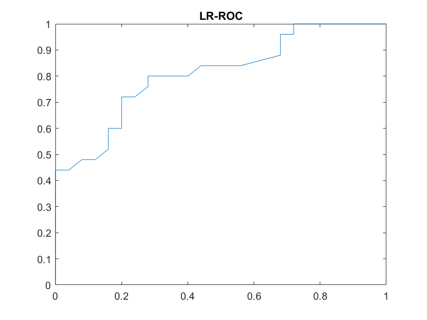
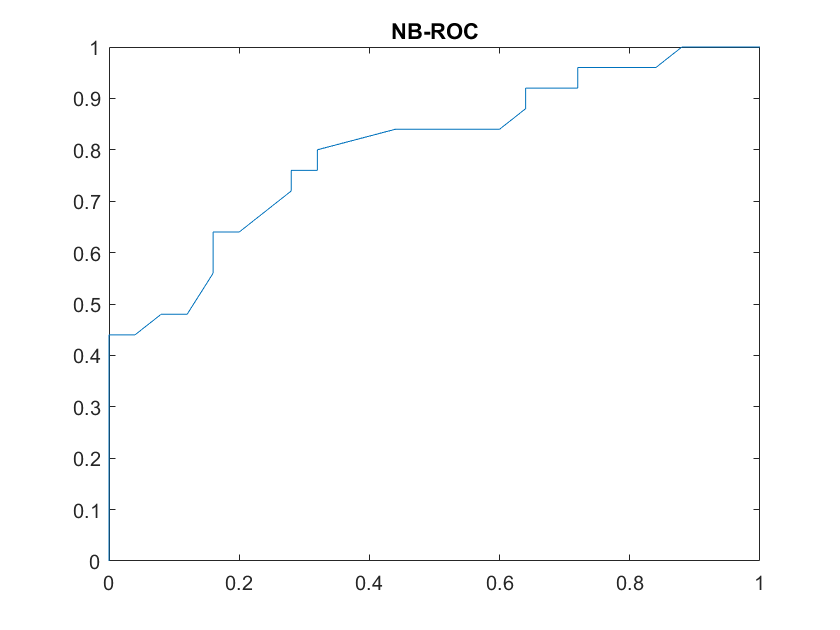

# DATA MINING - LAB 6

## 1 - K-MEANS CLUSTERING
6.  The cluster quality is lower (better) as we increase the number of means.
    The obtained values are as follows:
    1.  `K = 2 --> 83.3`
    2.  `K = 3 --> 62.7`
    3.  `K = 4 --> 56.9`
    4.  `K = 5 --> 56.3`

    For `K = 3`, the lowest seed value to result in cluster quality of `62.8`
    is `1`.
7.  The clustering accuracy and clustering quality at first are `0.8` and
    `62.8`, respectively. After setting `X = meas; d = 4;` the accuracy
    improved to `0.9` but the cluster quality became worse, to `97.2`, because
    considering more dimensions increased the distance between the points.


## 2 - ROC CURVES
7.  The code becomes:

    ```
    % preallocate arrays
    tpr_lr = zeros(101, 1);
    fpr_lr = zeros(101, 1);
    tpr_nb = zeros(101, 1);
    fpr_nb = zeros(101, 1);
    i = 1;

    for thr = 0:0.01:1
        % logistic regression
        predTr = pTrLR>thr;
        predTe = pTeLR>thr;
        fprintf(1,'LR Train acc: %1.2f\n', sum(Ytr==predTr)/numel(Ytr));
        fprintf(1,'LR Test acc: %1.2f\n',  sum(Yte==predTe)/numel(Yte));
        cmat = confusionmat(Yte,double(predTe))
        tpr_lr(i) = cmat(2,2)/sum(Yte==1);
        fpr_lr(i) = cmat(1,2)/sum(Yte==0);

        % naive bayes
        predTr = pTrNB(:,2)>thr;
        predTe = pTeNB(:,2)>thr;
        fprintf(1,'NB Train acc: %1.2f\n', sum(Ytr==predTr)/numel(Ytr));
        fprintf(1,'NB Test  acc: %1.2f\n', sum(Yte==predTe)/numel(Yte));
        cmat = confusionmat(Yte,double(predTe))
        tpr_nb(i)=cmat(2,2)/sum(Yte==1);
        fpr_nb(i)=cmat(1,2)/sum(Yte==0);

        i = i + 1;
    end
    ```
8.  The curves are as follows:
    
    
9.  The areas under the curve are `0.8104` for LR and `0.7992` for NB. This
    makes LR the preferable classifier in this case, because it has a better
    ration of true positives to false positives.
10. We use the data cursor to observe for both classifiers the TPR on the curve
    where FPR = `0.16`. LR has TPR of `0.6` and NB has TPR of `0.64`, so NB
    would be preferred under these constraints.
